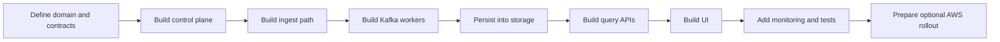

# Overview

## Project Summary

`PulseLens` is a multi-tenant observability platform for ingesting, processing, storing, and querying:

- logs
- metrics
- traces
- custom events

The system is meant to demonstrate strong backend engineering rather than just produce dashboards. The real value is in:

- tenant isolation
- event-driven processing
- ingestion throughput
- asynchronous workers
- retries and DLQ handling
- rate limiting
- deduplication
- time-series analytics
- operational clarity

## Why This Project Should Stay As-Is

This project should not be downgraded into a smaller CRUD app. The original idea is strong because it naturally forces good design decisions across:

- write-path scalability
- read-path efficiency
- control-plane versus data-plane separation
- fault tolerance
- platform observability
- SaaS-style multi-tenancy

That makes it more valuable in interviews than a simpler app with a public URL.

## Constraints

The implementation must respect three practical constraints:

1. `Zero recurring cost`
2. `Architecture style should stay close to existing Omniful Go services`
3. `The system should still look and behave like a production-shaped backend`

## Product Goals

- accept telemetry from many tenants
- isolate tenant data from ingest to query
- keep ingestion fast by making writes asynchronous
- support replay, retries, and dead-letter handling
- support logs, metrics, and traces through a single platform
- provide a minimal but useful UI for investigations
- expose a realistic path to AWS production deployment

## Non-Goals For V1

- full enterprise IAM suite
- billing engine
- advanced anomaly ML
- full OpenTelemetry parity on day one
- polished design system
- multi-region active-active deployment

## Final Delivery Shape

The final reviewed implementation should produce:

- one control-plane backend for tenant and auth concerns
- one ingest backend
- one query backend
- one worker backend running multiple worker modes
- one React UI
- local infrastructure via Docker Compose
- full architecture and rollout docs

## Working Modes

The project is designed in two modes.

### Mode 1: Zero-Cost Working System

Runs locally with:

- Kafka
- Redis
- ClickHouse
- PostgreSQL
- Prometheus
- Grafana
- Go services
- React UI

### Mode 2: Future Production Rollout

Kept as a design and deployment plan for:

- frontend hosting on AWS now if wanted
- full AWS service rollout later if budget exists

## Success Criteria

The project is successful when:

- two tenants can send telemetry safely without leakage
- ingestion returns quickly without synchronous storage dependency
- workers process logs, metrics, and traces independently
- retries and DLQ paths are working
- queries support time range, tenant, service, severity, and trace filters
- the UI can inspect recent telemetry
- the entire stack runs locally from documentation
- every major design choice is explainable

## High-Level Journey

## Why Local-First Is The Right Call

A live cloud deployment is optional. A local-first build is the correct first target because it lets you:

- finish the full system
- keep cost at zero
- prove every critical backend path
- collect screenshots and demo recordings
- talk through a real production plan honestly

