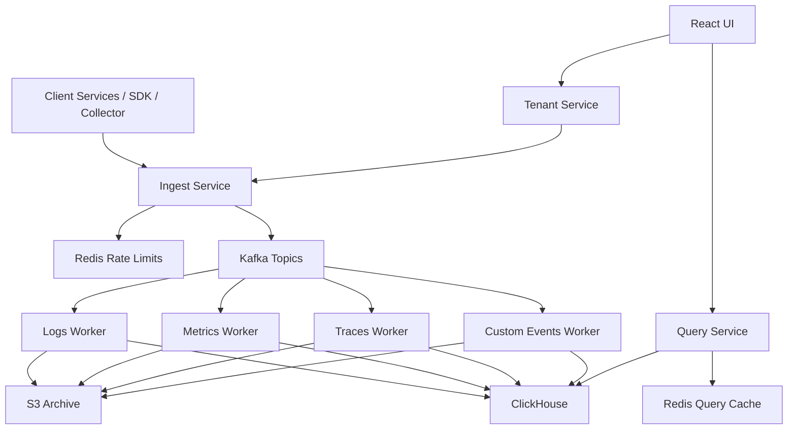

# System Architecture

## Architecture Principle

The platform should be split the same way strong internal product backends are split:

- a `control plane` for tenants, users, API keys, quotas, roles, and configuration
- a `data plane` for ingesting, processing, storing, and querying telemetry

This separation keeps ownership clean and prevents operational logic from leaking into hot data paths.

## Service Split

Recommended services:

- `tenant-service`
- `ingest-service`
- `processing-service`
- `query-service`
- `ui`

Optional later:

- `alerting-service`
- `notification-service`

## Why This Service Split

### `tenant-service`

Owns:

- tenants
- users
- API keys
- plans
- retention settings
- quota settings
- roles and permissions

Why:

- this data is relational
- it changes differently from telemetry
- it should not be coupled to Kafka or ClickHouse concerns

### `ingest-service`

Owns:

- request authentication
- tenant resolution
- schema validation
- rate limiting
- event normalization
- Kafka publishing

Why:

- the ingest path must stay fast
- this service should not block on storage
- it needs clear edge-level responsibility

### `processing-service`

Owns:

- logs consumer
- metrics consumer
- traces consumer
- retry handling
- dead-letter routing
- dedupe enforcement
- storage writes
- archival fanout

Why:

- consumers scale differently from APIs
- each signal type has different transformation rules
- retry and DLQ logic belongs on the async path

### `query-service`

Owns:

- logs search
- metrics aggregation
- trace lookup
- dashboard widgets
- saved query reads
- query caching

Why:

- read paths require different optimization from ingest paths
- it isolates storage and query planning concerns

### `ui`

Owns:

- logs explorer
- metrics explorer
- traces explorer
- dashboard screens
- settings and API key management

Why:

- UI should stay minimal
- backend depth is the primary value of the project

## Complete Logical Architecture

## Tenant Isolation Model

Tenant isolation is the first hard invariant of the system.

It must be enforced at:

- authentication
- ingest normalization
- Kafka event envelope
- storage schema
- query filters
- UI access rules

Tenant ID should never be optional after the first edge hop.

## Event Envelope

Every event should be normalized into a common envelope before it is published to Kafka.

Required envelope fields:

- `event_id`
- `tenant_id`
- `service_id`
- `service_name`
- `environment`
- `event_type`
- `schema_version`
- `occurred_at`
- `received_at`
- `trace_id`
- `source`
- `payload`

Why:

- workers need stable routing metadata
- dedupe depends on a stable event identity
- versioned envelopes make schema evolution manageable

## Storage Split

Use two storage classes.

### PostgreSQL

Use for:

- tenants
- users
- API keys
- quotas
- roles
- dashboards
- saved queries

### ClickHouse

Use for:

- logs
- traces
- metrics
- rollups
- usage aggregates
- DLQ investigation tables

Why:

- PostgreSQL fits control-plane relational data
- ClickHouse fits high-volume analytical reads and time-range filters

## Architecture Decision Summary

- keep APIs stateless
- keep storage writes asynchronous
- keep control plane and telemetry plane separate
- keep Redis on hot-path state only
- keep ClickHouse as hot telemetry store
- keep S3 for archive and replay, not primary query

