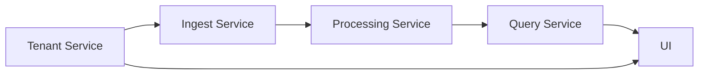

# Implementation Style

## Goal

The implementation should look and feel like the Go services you asked me to study, especially:

- `api-gateway`
- `analytics-service`
- `transport-shipping-service`
- `transit-wms-service`

That means this project should not look like a tutorial repo. It should follow the same service anatomy and separation of concerns.

## Repository Strategy

Use multiple repositories, not one giant monolith.

Recommended repositories:

- `pulselens-tenant-service`
- `pulselens-ingest-service`
- `pulselens-processing-service`
- `pulselens-query-service`
- `pulselens-ui`
- `pulselens-deploy`

Why:

- this matches your existing service ecosystem
- each service can have its own lifecycle
- worker-heavy services remain isolated
- APIs stay smaller and easier to reason about

## Per-Service Structure

Each Go service should follow a structure close to this:

```text
configs/
init/
router/
internal/
  <module>/
    controllers/
    service/
    repository/
    requests/
    responses/
    adapters/
pkg/
  error/
  http_response/
  kafka/
  redis/
  validate/
  monitoring/
main.go
go.mod
```

## Why This Shape

### `main.go`

Owns:

- config init
- context creation
- app init
- mode selection
- http server or worker start

Why:

- this is exactly how your current services start
- it keeps bootstrap concerns out of business modules

### `init/`

Owns:

- logger init
- config binding
- Redis init
- Kafka init
- database init
- localization if needed
- monitoring init

Why:

- it keeps startup logic in one predictable place
- every service can own only the dependencies it needs

### `router/`

Owns:

- middleware registration
- health routes
- route grouping
- controller wiring

Why:

- your existing services centralize routing here
- it keeps controllers focused on request handling only

### `internal/<module>/controllers`

Owns:

- binding requests
- param parsing
- calling services
- returning responses

Should stay thin.

Why:

- this matches `transport-shipping-service` and `transit-wms-service`
- thin handlers are easier to test and review

### `internal/<module>/service`

Owns:

- business rules
- orchestration
- cross-service calls
- retries and validation decisions

Why:

- this is where the actual complexity belongs
- it keeps request/response glue away from business logic

### `internal/<module>/repository`

Owns:

- database access
- query building
- caching helpers if tightly coupled

Why:

- it keeps storage code isolated
- it allows service logic to stay storage-agnostic enough

## Wiring Pattern

Use the same style your services already use:

- plain constructors where simple
- `wire` for modules with heavier dependency graphs
- singleton/shared client init only where justified

Recommended use:

- `tenant-service`: plain constructors or light wire
- `ingest-service`: plain constructors
- `processing-service`: constructors plus worker registries
- `query-service`: module wiring for query handlers and storage services

## Error Model

Each service should have its own `pkg/error` package with:

- custom codes
- mapping to HTTP status
- helper constructors
- response helpers

Why:

- this keeps errors service-specific
- it matches your current Omniful services

## Response Model

Use shared response conventions:

- success response
- success response with metadata
- paginated metadata
- error response with custom code mapping

Why:

- consistent payload shape improves UI integration
- it mirrors your existing APIs

## Worker Model

`processing-service` should support worker mode the same way your other services do.

Recommended worker groups:

- `logs`
- `metrics`
- `traces`
- `retry`
- `dlq-replay`
- `rollups`

Why:

- independent scaling
- selective startup in local testing
- easy debug by worker group

## Implementation Rules

- controllers stay thin
- services own logic
- repositories stay focused
- config is centralized
- no synchronous storage writes on ingest path
- every event carries tenant context
- every query path injects tenant filters
- every batch worker is idempotent

## Service Interaction Map



