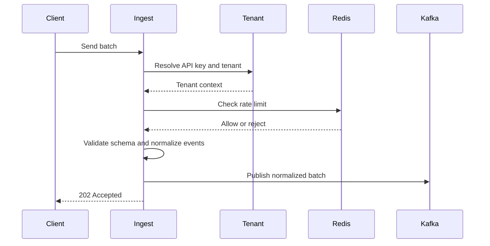
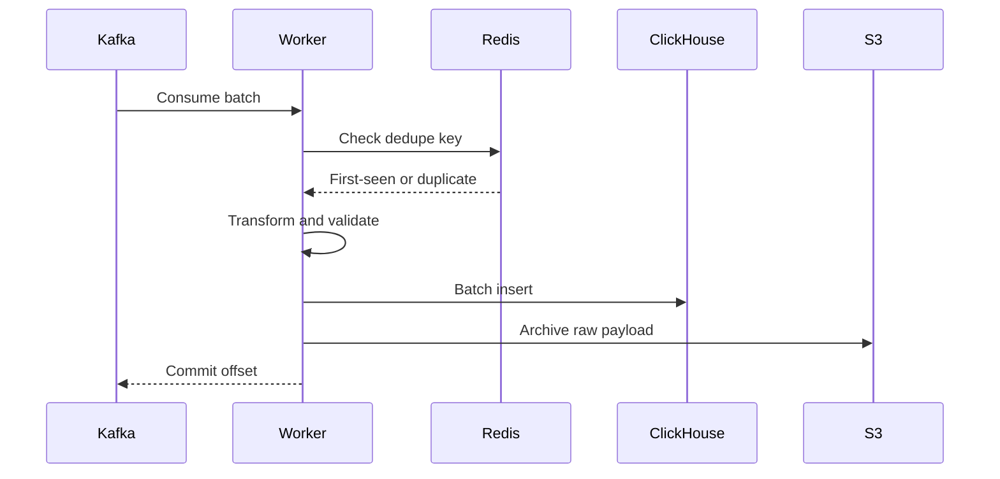
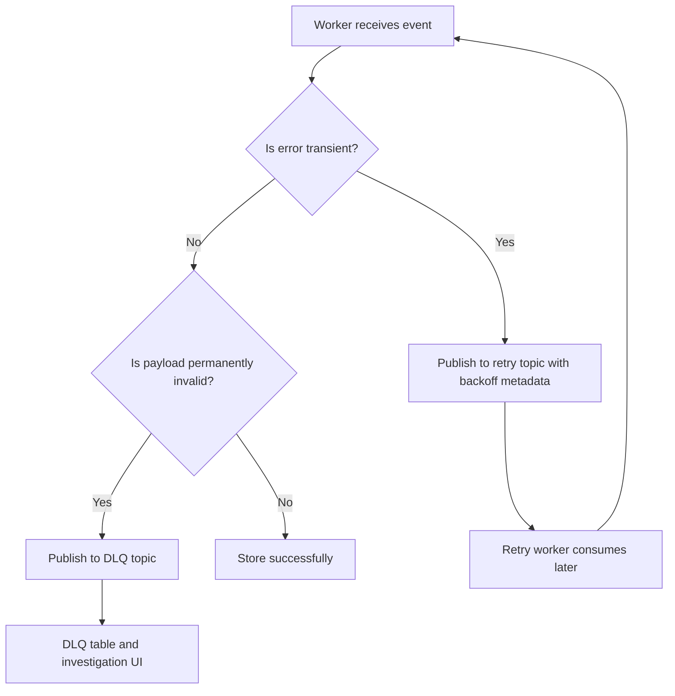
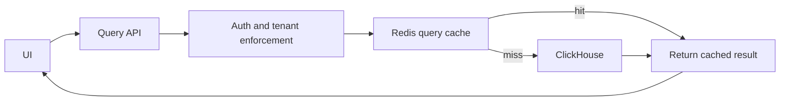

# Data And Flows

## Control Plane Versus Data Plane

The system has two data worlds.

### Control Plane

Stored in PostgreSQL:

- tenants
- users
- API keys
- plans
- quotas
- dashboards
- saved queries
- alert rules

### Data Plane

Stored in ClickHouse and S3:

- raw logs
- raw traces
- raw metrics
- derived rollups
- archived batches
- dead-letter records

Why this split matters:

- relational changes and telemetry writes have different scaling patterns
- mixing them makes both worse

## Data Model

### Tenant

- `tenant_id`
- `name`
- `plan`
- `ingest_quota`
- `retention_policy`
- `status`
- `created_at`

### Service

- `service_id`
- `tenant_id`
- `name`
- `environment`
- `tags`

### Event Envelope

- `event_id`
- `tenant_id`
- `service_id`
- `event_type`
- `schema_version`
- `occurred_at`
- `received_at`
- `trace_id`
- `severity`
- `payload`

### Log Record

- `tenant_id`
- `service_id`
- `timestamp`
- `level`
- `message`
- `trace_id`
- `attributes`

### Metric Point

- `tenant_id`
- `service_id`
- `metric_name`
- `metric_value`
- `timestamp`
- `labels`

### Trace Span

- `tenant_id`
- `trace_id`
- `span_id`
- `parent_span_id`
- `service_id`
- `start_time`
- `end_time`
- `status`
- `attributes`

### DLQ Event

- `event_id`
- `tenant_id`
- `event_type`
- `failure_reason`
- `retry_count`
- `payload`
- `created_at`

## Kafka Topics

Recommended topics:

- `pulselens.logs.v1`
- `pulselens.metrics.v1`
- `pulselens.traces.v1`
- `pulselens.events.v1`
- `pulselens.retry.v1`
- `pulselens.dlq.v1`

Why separate them:

- signal types scale differently
- consumers remain simpler
- replay and debugging are clearer

## Partitioning Strategy

### Kafka

- logs partition key: `tenant_id + service_id`
- metrics partition key: `tenant_id + metric_name`
- traces partition key: `tenant_id + trace_id`

Why:

- preserve useful locality
- avoid random partition spread
- keep trace-related events together

### ClickHouse

- partition by time window
- order by tenant and service before timestamp

Suggested sort key shape:

- `(tenant_id, service_id, timestamp, event_id)`

Why:

- queries are mainly tenant-scoped and time-scoped
- this reduces scan cost for common queries

## Redis Key Design

- `rl:tenant:{tenant_id}`
- `rl:key:{api_key_id}`
- `dedupe:{tenant_id}:{event_id}`
- `cache:query:{tenant_id}:{query_hash}`
- `quota:tenant:{tenant_id}`
- `trace_seen:{tenant_id}:{trace_id}`

Why:

- namespaced keys prevent collisions
- TTL keeps ephemeral state cheap
- tenant-aware keys reduce leakage risk

## Ingestion Flow

## Processing Flow

## Retry And DLQ Flow

## Query Flow

## Why Idempotency Is Mandatory

Kafka consumers are usually at-least-once. That means duplicates are normal, not exceptional.

So the system must:

- require `event_id`
- check a dedupe key before write
- make inserts safe to repeat
- tolerate consumer retry without duplicate visible records

## Retention Model

Retention should be tenant-plan aware.

Example:

- free tier tenant: shorter hot retention
- paid/internal tenant: longer hot retention
- all tenants: S3 archive beyond hot retention

Why:

- observability data grows fast
- storage control is part of product design, not an afterthought

