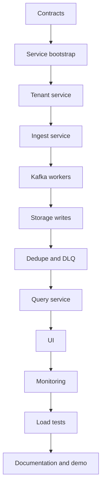

# Build Plan

## Principle

The build should move from `control and contracts` to `write path`, then to `read path`, then to `operations`.

Do not start with the UI.

## Phase 0: Finalize Contracts

Deliverables:

- tenant model
- API key model
- event envelope
- signal schemas
- custom error code lists
- service boundaries

Why first:

- everything else depends on these contracts
- changing envelope shape late will ripple across all services

Acceptance criteria:

- telemetry payload versions are defined
- tenant ID propagation rules are written down
- event types are frozen for V1

## Phase 1: Bootstrap Repositories

Deliverables:

- repository creation
- base folder structure
- shared coding conventions
- service bootstrap skeletons
- Docker Compose base file

Why:

- consistent scaffolding reduces churn later
- it keeps all services aligned with Omniful patterns from the start

Acceptance criteria:

- every backend service can start in empty mode
- health routes work
- config and logger boot correctly

## Phase 2: Build `tenant-service`

Deliverables:

- tenants CRUD
- users and roles
- API keys
- service registration
- plan and quota configuration

Why:

- ingest cannot safely exist before tenant and API key ownership exists

Acceptance criteria:

- API key resolves exactly one tenant
- role checks are ready for later UI and query actions

## Phase 3: Build `ingest-service`

Deliverables:

- auth middleware
- tenant resolution
- request validation
- batch ingest endpoint
- rate limiting
- event normalization
- Kafka producer

Why:

- the ingest path is the entry point of the whole system

Acceptance criteria:

- invalid payloads fail fast
- valid payloads return `202`
- no synchronous ClickHouse dependency exists

## Phase 4: Bring Up Kafka And Worker Skeleton

Deliverables:

- topic creation strategy
- worker registry
- consumer group bootstrapping
- logs worker shell
- metrics worker shell
- traces worker shell

Why:

- the async pipeline must exist before storage writes

Acceptance criteria:

- workers consume from topics successfully
- offsets commit correctly on success

## Phase 5: Implement Storage Writes

Deliverables:

- ClickHouse schema
- batch insert adapters
- log writes
- metric writes
- trace writes

Why:

- this is the first point where telemetry becomes queryable

Acceptance criteria:

- workers write batched data successfully
- storage tables remain tenant-aware

## Phase 6: Add Dedupe, Retry, And DLQ

Deliverables:

- Redis dedupe keys
- transient error classification
- retry publish path
- retry worker
- DLQ topic and DLQ persistence

Why:

- reliability is a core differentiator of the project

Acceptance criteria:

- duplicate event replay does not duplicate visible storage
- invalid events land in DLQ with reason

## Phase 7: Build `query-service`

Deliverables:

- logs query endpoints
- metrics aggregation endpoints
- trace lookup endpoints
- filtering and pagination
- tenant-safe query enforcement

Why:

- once the write path is stable, the read path becomes useful

Acceptance criteria:

- tenant queries return only their own data
- logs, metrics, and traces are all queryable

## Phase 8: Add Query Cache And Rollups

Deliverables:

- Redis query cache
- ClickHouse rollups
- hot dashboard endpoints

Why:

- common dashboards should not repeatedly scan raw data

Acceptance criteria:

- repeated dashboard queries are faster
- cached responses are tenant-aware

## Phase 9: Build UI

Deliverables:

- login and workspace context
- logs explorer
- metrics explorer
- traces explorer
- dashboard page
- API key management page

Why:

- the UI proves product usability, but only after the backend is credible

Acceptance criteria:

- UI can drive all major read paths
- tenant switching is explicit and safe

## Phase 10: Add Monitoring

Deliverables:

- service metrics
- Kafka lag dashboards
- Redis usage dashboards
- worker error dashboards
- ingest latency dashboards

Why:

- the platform must observe itself

Acceptance criteria:

- you can diagnose slow ingest, lagging workers, and failed writes

## Phase 11: Add Load Testing

Deliverables:

- k6 scenarios
- multi-tenant test data
- burst traffic tests
- retry failure drills

Why:

- throughput and backpressure are part of the value of the project

Acceptance criteria:

- you can produce real latency and throughput numbers

## Phase 12: Demo And Documentation Finish

Deliverables:

- screenshots
- sample datasets
- short demo script
- architecture notes
- future AWS rollout plan

Why:

- the implementation only becomes interview-useful when it is easy to show and explain

Acceptance criteria:

- a reviewer can understand the system without reading all source code

## Delivery Flow

