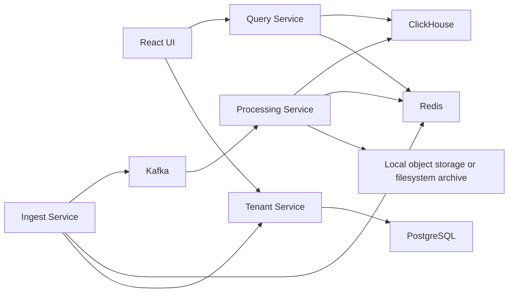

# Local Development

## Why Local-First

The full platform should run locally because:

- the goal is zero recurring cost
- all critical backend paths can still be proven
- Docker Compose is enough for this scale
- you can demonstrate the real system without cloud spend

## Local Stack

Run locally with:

- `pulselens-tenant-service`
- `pulselens-ingest-service`
- `pulselens-processing-service`
- `pulselens-query-service`
- `pulselens-alerting-service`
- `pulselens-archive-service`
- `pulselens-ui` via `vite preview` on `:3000`
- `Kafka`
- `Redis`
- `ClickHouse`
- `PostgreSQL`
- `MinIO` or compatible object store
- `MailHog`

## Local Topology

## Runtime Model

- config files stay on `localhost`
- runtime normalization happens in client code, not by rewriting config hostnames
- `scripts/setup_local_infra.sh` prefers repo-owned Redis, ClickHouse, and MinIO
- `scripts/setup_local_infra.sh` reuses existing local Postgres, Kafka, and MailHog if those ports are already occupied
- `scripts/run_local_services.sh` builds Go binaries first, then starts services from `bin/`
- `http://127.0.0.1:3000` is the authoritative local UI path for validation

## Recommended Local Storage Adjustments

For zero-cost local development:

- use local filesystem or MinIO-compatible storage instead of real S3
- keep archive layout S3-like so future migration is easy

Why:

- preserves production semantics without cloud cost

## Local Demo Dataset

Prepare at least:

- `tenant-alpha`
- `tenant-beta`
- `checkout-service`
- `catalog-service`
- `shipping-service`

And generate:

- normal request logs
- warning/error bursts
- a few metrics with labels
- traces spanning multiple services

Why:

- demo data should prove isolation and distributed flow

## Local Acceptance Demo

The reviewer should be able to do this:

1. Create or seed tenants
2. Create API keys
3. Send telemetry for tenant A and tenant B
4. Verify both are ingested
5. Trigger retries and one DLQ case
6. Search logs by tenant and service
7. Open a trace by trace ID
8. View metrics rollups in the UI
9. Inspect runtime, dependency health, Kafka lag, and cleanup visibility in the UI

## Local Run Order

1. `bash scripts/setup_local_infra.sh`
2. `cd services/pulselens-ui && npm install && npm run build`
3. `bash scripts/run_local_services.sh`
4. Open `http://127.0.0.1:3000`
5. Optionally run:
   - `python3 scripts/smoke_test.py`
   - `bash scripts/curl_smoke.sh`
   - `python3 scripts/load_test.py`
   - `python3 scripts/soak_test.py`
   - `python3 scripts/failure_drill.py`
   - `python3 scripts/chaos_redis_drill.py`
   - `python3 scripts/chaos_clickhouse_drill.py`

## Local Test Layers

### Unit Tests

For:

- request validation
- service logic
- dedupe helpers
- rate limit logic
- error mapping

### Integration Tests

For:

- Kafka publish and consume
- Redis dedupe and rate limit
- ClickHouse inserts and queries
- PostgreSQL control-plane flows

### End-To-End Tests

For:

- full ingest to query journey
- cross-tenant isolation
- retry and DLQ scenarios
- browser workflow through Playwright against `:3000`

## Load Testing Plan

Use `k6`.

Scenarios:

- constant low traffic
- burst traffic
- multi-tenant mixed traffic
- duplicate replay traffic
- degraded worker/storage conditions

Metrics to capture:

- ingest p95
- query p95
- Kafka lag
- worker throughput
- DLQ rate
- retry success rate

## Why This Matters In Review

Interviewers trust real measured behavior more than claims. A local benchmark with a believable setup is far better than a cloud URL with shallow logic.
