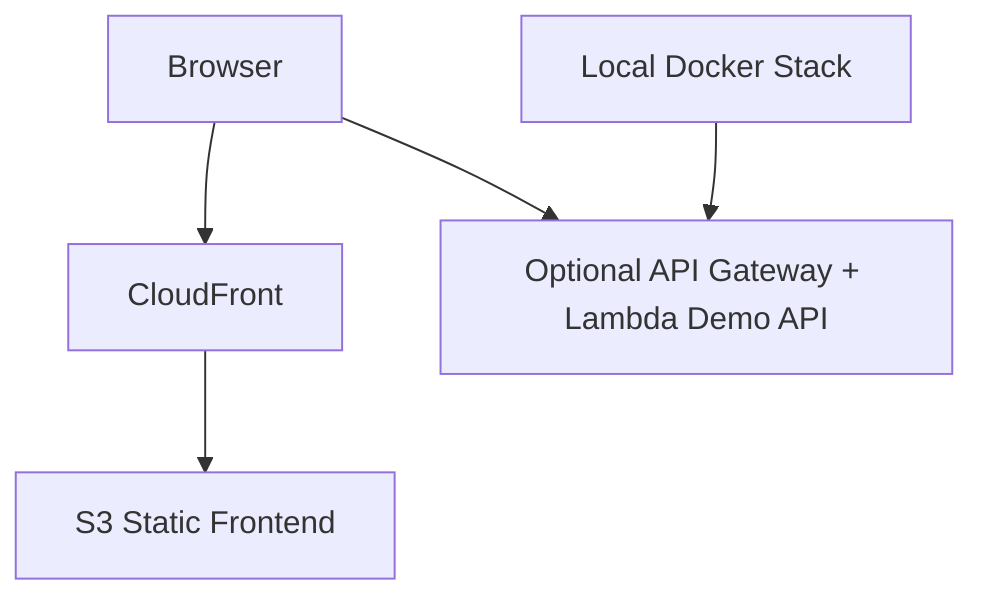
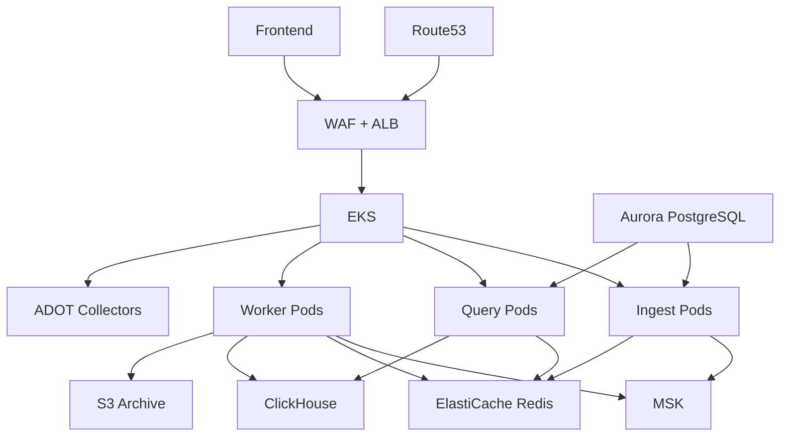

# AWS Deployment

## First Principle

There are two AWS stories for this project.

### Story 1: Zero-Cost Practical Deployment

Host only cheap or optional surfaces on AWS.

### Story 2: Full Future Production Rollout

Keep a full AWS production plan documented, but do not run it until budget exists.

This lets the implementation stay honest and still show strong production thinking.

## What To Put On AWS Now

Recommended zero-cost or near-zero AWS footprint:

- frontend on `S3 + CloudFront`
- optional domain on `Route 53`
- optional TLS with `ACM`
- optional tiny demo API on `Lambda + API Gateway`

Why:

- the frontend is cheap to host
- it gives you a public demo surface if needed
- it avoids trying to run Kafka, Redis, and ClickHouse in paid managed services

## What Should Stay Local For Now

- Kafka
- Redis
- ClickHouse
- PostgreSQL control plane
- processing workers
- full query API

Why:

- these are the cost-heavy parts
- they are not required to prove the implementation

## Zero-Cost Deployment Topology

The full product remains local. AWS only exposes the easiest presentation layer.

## Future Full AWS Production Architecture

When budget exists, move toward:

- `EKS` for services and workers
- `MSK` for Kafka
- `ElastiCache Redis`
- `Aurora PostgreSQL`
- `ClickHouse` on EKS or managed alternative if chosen later
- `S3` for archive and backups
- `Prometheus` and `Grafana` stack

## Full AWS Production Flow

## Full AWS Rollout Steps

### Phase A: Foundation

- create account boundaries
- configure IAM roles
- create VPC
- create subnets across AZs
- configure security groups
- create ECR repositories

Why:

- infrastructure boundaries must exist before app deployment

### Phase B: Runtime

- create EKS cluster
- install ingress and autoscaling components
- enable IRSA
- deploy base monitoring components

Why:

- every app service depends on runtime primitives

### Phase C: Data Services

- create MSK
- create ElastiCache Redis
- create Aurora PostgreSQL
- deploy ClickHouse
- create S3 archive buckets

Why:

- app services cannot run realistically without their backing services

### Phase D: Application Deploy

- deploy tenant-service
- deploy ingest-service
- deploy processing-service
- deploy query-service
- deploy UI

Why:

- dependencies should already exist by this point

### Phase E: Production Hardening

- backups
- alarms
- WAF rules
- secret rotation
- retention jobs
- autoscaling policies

Why:

- a live system without operational controls is incomplete

## Why Keep This AWS Section Even If Not Live

Because it proves:

- you know what production would require
- you understand managed-service trade-offs
- you are not confusing “works on laptop” with “ready for production”

## Review Guidance

When reviewing the project, treat AWS as:

- `current optional demo surface`
- `future real production target`

Do not treat it as a blocker for building the actual system.

