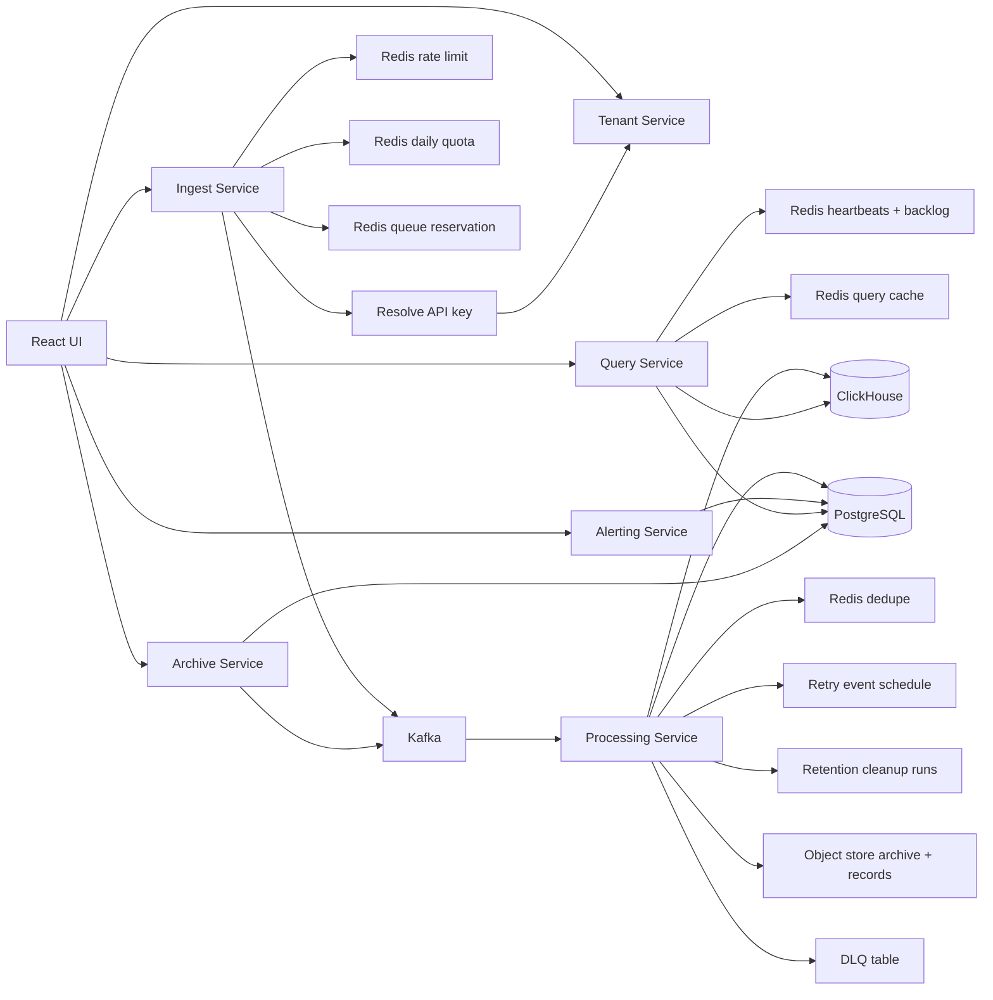
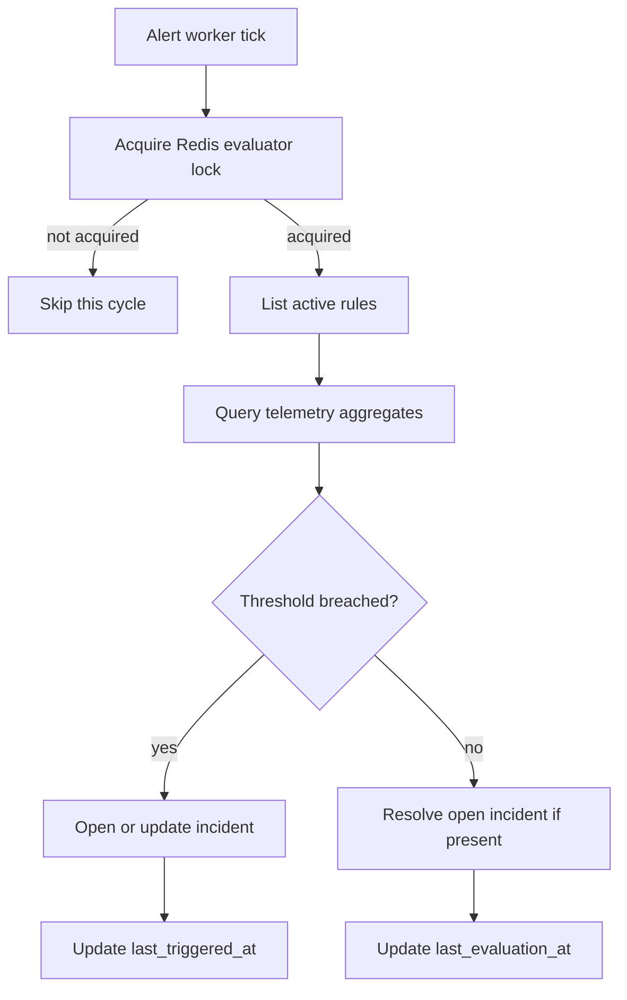
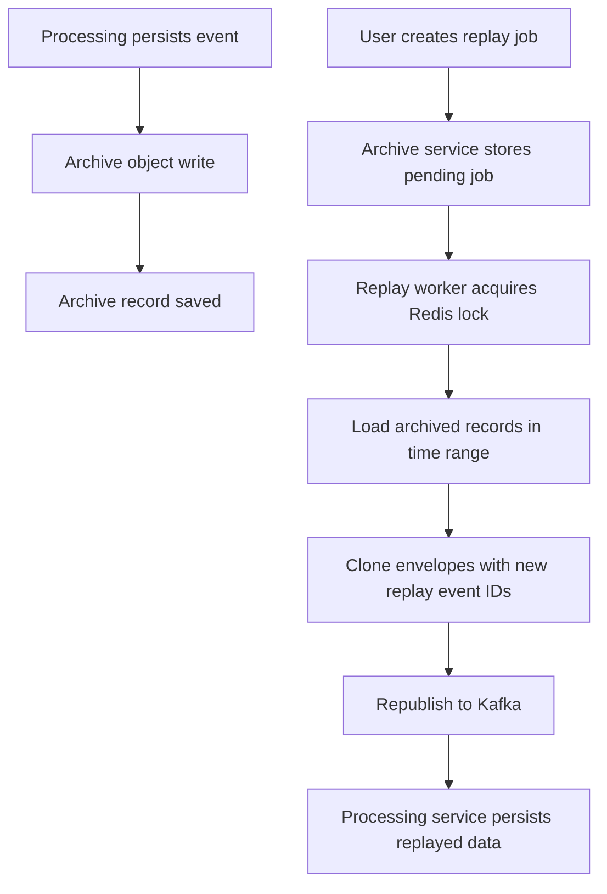

# Implemented System

This document describes the repository exactly as implemented and tested.

## Implemented Shape

### Shared Modules

- `libs/pulselens-common`
  - shared JWT claims
  - telemetry DTOs
  - tenant resolution DTOs
- `libs/pulselens-platform`
  - local replacement for the minimum common layer instead of directly importing `go-commons`
  - config loader
  - HTTP server wrapper
  - JSON response helpers
  - JWT helpers
  - Redis helper
  - Kafka producer and consumer-group wrapper
  - Postgres helper
  - ClickHouse HTTP client
  - S3-compatible object-store client
  - fixed-window rate limiting
  - daily quota reservation
  - Snowflake-style sortable ID generation
  - rendezvous hashing
  - Redis distributed lock helper
  - service heartbeat registry
  - Redis-backed queue backpressure control

### Services

- `services/pulselens-tenant-service`
  - tenants
  - users
  - services
  - API keys
  - audit logs
  - JWT login
- `services/pulselens-ingest-service`
  - API key auth
  - payload validation by event type
  - rate limiting
  - daily quota enforcement
  - Redis-backed pending-queue reservation
  - envelope normalization
  - Kafka publish
- `services/pulselens-processing-service`
  - Kafka consumption
  - dedupe
  - PostgreSQL persistence
  - PostgreSQL minute rollups for telemetry, metrics, and service health
  - ClickHouse hot-store mirroring
  - ClickHouse materialized minute rollups
  - delayed retry scheduling
  - DLQ persistence
  - usage counter aggregation
  - object-store archive persistence
  - tenant-aware retention cleanup runs
- `services/pulselens-query-service`
  - overview APIs
  - logs, metrics, traces
  - analytics rollups for log severity, metric series, and trace latency
  - platform dependency health and Kafka lag APIs
  - ClickHouse-authoritative telemetry reads with explicit degraded-mode errors
  - ClickHouse-first aggregate reads from rollup tables
  - Redis query caching with tenant-scoped invalidation
  - signal-aware filter handling so logs, metrics, traces, and rollups do not share one generic filter clause
  - service health summary
  - platform runtime visibility
  - queue backpressure visibility
  - cleanup run visibility
  - saved queries
  - saved dashboards
  - legacy embedded UI path, while Vite preview on `:3000` remains the authoritative local UI
- `services/pulselens-alerting-service`
  - alert rule CRUD
  - incident listing
  - incident assignment and escalation
  - incident acknowledge and resolve actions
  - incident comments
  - notification channel management
  - notification delivery tracking
  - real webhook delivery
  - Slack-webhook-style delivery
  - SMTP email delivery through MailHog/local SMTP
  - worker evaluation loop
  - distributed evaluator lock
- `services/pulselens-archive-service`
  - replay job APIs
  - replay worker
  - object-store-backed replay reads
  - replay lock ownership
- `services/pulselens-ui`
  - React + Vite frontend
  - real SVG widgets and charts for log severity, metric trends, trace latency, and dependency health
  - bootstrap, login, ingest playground, analytics rollups, alerts, incidents, assignment, comments, notification channels, replay jobs, audit log, users, service health, saved queries, saved dashboards
  - dashboard builder with widget create, edit, reorder, delete, preview, and persisted layout/filter state
  - incident detail workspace with timeline, comments, deliveries, and escalation visibility
  - Playwright browser E2E coverage

### Packaging

- root `docker-compose.yml`
- per-service `Dockerfile`
- docker-specific config files under every service `configs/docker.yaml`
- optional Helm chart under `deploy/helm/pulselens`

## Package Layout Standard

The Go services now follow the structure you asked for:

- `main.go`
- `configs/`
- `init/`
- `router/`
- `internal/<module>/controllers`
- `internal/<module>/middleware`
- `internal/<module>/models`
- `internal/<module>/repositories`
- `internal/<module>/requests`
- `internal/<module>/responses`
- `internal/<module>/services`
- `internal/<module>/workers`
- `pkg/` for small infra state wrappers only

That removes the earlier flat `internal` layout and keeps request, response, model, repository, and service code separated for readability.

## Production Features Added

Beyond the first working cut, the implementation now includes:

- audit logging for tenant-side control-plane actions
- schema validation for log, metric, and trace ingest payloads
- daily ingest quota enforcement in Redis
- usage counters by signal type and date
- Snowflake-style sortable IDs derived from service node IDs
- rendezvous-hash-based shard assignment
- service heartbeats in Redis with health status projection
- queue backlog reservation and overload rejection in ingest
- ClickHouse hot-store schema and mirror writes for telemetry events
- ClickHouse-authoritative telemetry reads while PostgreSQL remains the compatibility persistence store
- explicit degraded telemetry responses instead of silent PostgreSQL fallback when ClickHouse is unavailable
- Redis TTL query caching for logs, metrics, traces, health, and overview counts
- tenant-scoped cache-version bumps on telemetry writes, cleanup, saved-query writes, and dashboard writes
- dataset-aware widget filter normalization so saved dashboard widgets and draft previews behave consistently
- PostgreSQL minute rollups for query-side counts, service-health summaries, log severity, metric series, and trace latency
- delayed retry scheduling via retry topic plus retry event table
- tenant-aware retention windows driven from tenant metadata
- S3-compatible object-store archive persistence plus archive record indexing
- replay jobs that load archived objects and republish with new replay event IDs
- retention cleanup runs for telemetry, rollups, retries, DLQ, and archive objects
- alert rules and incidents
- incident acknowledge, resolve, assign, and escalation workflow
- incident comments
- notification channels and delivery records
- webhook notification delivery with response capture and retry attempts
- evaluator worker protected by Redis lock
- service health summary derived from recent telemetry
- saved queries and dashboards
- React UI instead of static HTML
- real chart widgets in the UI instead of only tables
- explicit curl-based verification script in addition to the Python smoke script
- Playwright browser E2E test for bootstrap, ingest, analytics, widget edit/reorder/delete, incident workspace visibility, user creation, and webhook-channel creation
- concurrent local load-test script for ingest and query paths
- soak-test script for sustained ingest/query pressure
- failure-drill script for notification-path failure validation
- docker-compose packaging for a repo-owned runtime
- optional Helm assets for local Kubernetes experimentation

## End-to-End Data Flow

## Alerting Flow

## Replay Flow

## Tables In Use

### Control Plane

- `tenants`
- `users`
- `services`
- `api_keys`
- `audit_logs`

### Telemetry Plane

- `log_events`
- `metric_points`
- `trace_spans`
- `custom_events`
- `dead_letter_events`
- `usage_counters`
- `retry_events`
- `archive_records`
- `cleanup_runs`
- `telemetry_rollup_minutes`
- `metric_rollup_minutes`
- `service_health_rollup_minutes`
- `log_severity_rollup_minutes`
- `trace_latency_rollup_minutes`

### Alerting

- `alert_rules`
- `incidents`
- `incident_comments`
- `notification_channels`
- `notification_deliveries`

### Archive And Replay

- `replay_jobs`

## Validation That Passed

### Go Validation

Passed:

- `libs/pulselens-common`
- `libs/pulselens-platform`
- `services/pulselens-tenant-service`
- `services/pulselens-ingest-service`
- `services/pulselens-processing-service`
- `services/pulselens-query-service`
- `services/pulselens-alerting-service`
- `services/pulselens-archive-service`

### Runtime Validation

Passed:

- `python3 scripts/smoke_test.py`
- `bash scripts/curl_smoke.sh`
- `python3 scripts/load_test.py`
- `python3 scripts/soak_test.py`
- `python3 scripts/failure_drill.py`
- `npx playwright test`

Observed results from the latest run:

- smoke:
  - dependency count `4`
  - Kafka lag rows `6`
  - webhook delivery count `2`
  - MailHog message count `4`
- load:
  - ingest p95 `317.29ms`
  - query p95 `80.32ms`
  - failures `0`
- soak:
  - duration `20s`
  - ingest requests `105`
  - query requests `52`
  - failures `0`
- failure drill:
  - failed deliveries `1`
  - broken webhook path recorded as expected
- `services/pulselens-archive-service`

### Frontend Validation

Passed:
- `npm run test -- --run`
- `npm run build`
- `npx playwright test`

### Runtime Validation

Passed:

- `python3 scripts/smoke_test.py`
- `bash scripts/curl_smoke.sh`
- `python3 scripts/load_test.py`

Latest load-test result:

- `ingest_requests=120`
- `query_requests=40`
- `failures=0`
- `ingest_p95_ms=140.28`
- `query_p95_ms=67.5`
- `npm run build`
- `npm run test -- --run`
- `npx playwright test`

### Live Smoke Validation

Passed:

- `python3 scripts/smoke_test.py`
- `bash scripts/curl_smoke.sh`

Observed live results included:

- tenant creation
- service creation
- API key creation
- JWT login
- log, metric, and trace ingest
- query overview success
- ClickHouse table population success
- service health aggregation
- alert rule creation
- incident creation
- webhook notification delivery
- saved query creation
- dashboard creation
- replay job creation
- replayed log event ingestion
- archive object count visibility
- runtime heartbeat visibility
- backpressure snapshot visibility
- cleanup run visibility
- audit log retrieval
- Vite preview UI served on `http://127.0.0.1:3000`

## Local Run Order

1. `bash scripts/setup_local_infra.sh`
2. `cd services/pulselens-ui && npm install && npm run build`
3. `bash scripts/run_local_services.sh`
4. open `http://127.0.0.1:3000`
5. optionally run `python3 scripts/smoke_test.py`
6. optionally run `bash scripts/curl_smoke.sh`

## Known Trade-Offs

- telemetry is still mirrored into PostgreSQL as the compatibility store, rather than using ClickHouse-only persistence
- delayed retry still uses app-managed scheduling instead of broker-native delayed delivery
- cache invalidation is tenant- and dashboard-scoped, but still not query-shape aware
- no notification providers beyond webhook-compatible delivery and local MailHog-backed email
- no full permission matrix or SSO/MFA layer beyond the current tenant roles

These are intentional scope limits for a local-first, zero-recurring-cost version, while keeping the codebase production-shaped.
